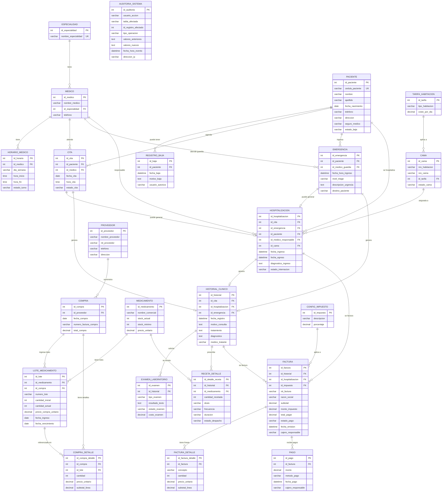

# Diagrama Entidad-Relación

A continuación se presenta el diagrama ER del sistema, representando todas las entidades del negocio y sus relaciones. El diagrama está generado con Mermaid y refleja el esquema real de la base de datos MySQL.

## Diagrama General del Sistema

## Descripción de las Relaciones Principales

### Módulo de Atención

- Un **PACIENTE** puede agendar múltiples **CITAS** y tener múltiples ingresos de **EMERGENCIA**.
- Cada **CITA** o **EMERGENCIA** puede derivar en una **HOSPITALIZACION**.
- Toda atención (cita, emergencia u hospitalización) genera un **HISTORIAL_CLINICO**.

### Módulo Clínico

- Cada **HISTORIAL_CLINICO** puede tener múltiples **EXAMEN_LABORATORIO** solicitados y múltiples **RECETA_DETALLE** prescritas.

### Módulo de Farmacia

- Un **MEDICAMENTO** tiene múltiples **LOTE_MEDICAMENTO** (control FIFO por fecha de vencimiento).
- Las **COMPRAS** a **PROVEEDORES** generan nuevos lotes y detalles de compra.

### Módulo de Facturación

- Una **FACTURA** consolida los cargos de un historial clínico y/o una hospitalización.
- Cada factura puede recibir múltiples **PAGOS** parciales hasta completarse.
- La configuración de **CONFIG_IMPUESTO** determina el porcentaje aplicado.

### Auditoría

- La tabla **AUDITORIA_SISTEMA** es independiente y se llena automáticamente mediante triggers de MySQL. No tiene relaciones de clave foránea con otras tablas.
