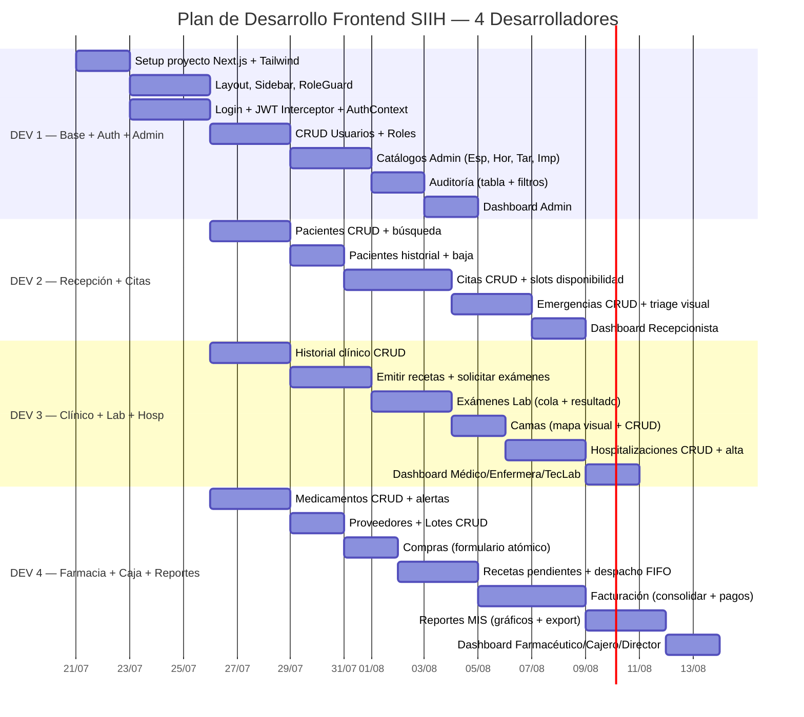
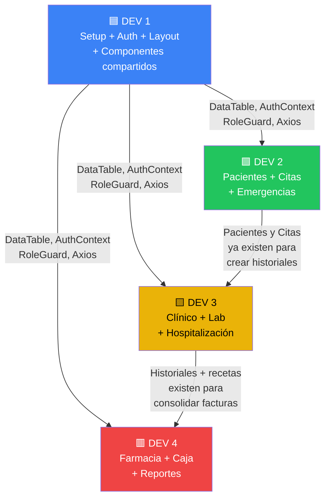

# Requerimientos del Frontend — SIIH (Next.js)
### Hospital Universitario San Andrés — UMSA / Inf-266

> Este documento fue generado a partir del análisis completo del backend Django
> (12 apps, ~35 endpoints REST, 8 roles RBAC, lógica de negocio en services y
> triggers MySQL). Define todo lo que el frontend Next.js necesita implementar
> para consumir el 100% del API `http://localhost:8000/api/v1/`.

---

## 1. Stack tecnológico del Frontend

| Componente | Tecnología | Justificación |
|---|---|---|
| Framework | **Next.js 14+ (App Router)** | SSR/SSG para SEO, layouts anidados por rol, middleware de auth |
| Lenguaje | **TypeScript** | Tipado fuerte para los ~35 endpoints y sus DTOs |
| Estilos | **Tailwind CSS 3** + componentes UI (shadcn/ui o similar) | Desarrollo rápido, dark mode, responsive |
| Estado global | **Zustand** o React Context | Para auth state (JWT, usuario, roles) |
| HTTP Client | **Axios** con interceptores | Auto-refresh de JWT, manejo centralizado de errores |
| Formularios | **React Hook Form + Zod** | Validación client-side que replica las reglas del backend |
| Tablas | **TanStack Table** | Paginación server-side (PageNumberPagination, page_size=20) |
| Gráficos | **Recharts** o **Chart.js** | Dashboard de reportes MIS |
| Notificaciones | **React Hot Toast** o **Sonner** | Feedback visual de éxito/error |
| Exportación | Descarga directa de archivos | Los endpoints de reportes devuelven Excel/CSV |

---

## 2. Configuración de conexión al Backend

```env
# .env.local
NEXT_PUBLIC_API_BASE_URL=http://localhost:8000/api/v1
```

### 2.1 Interceptor Axios (auto-refresh JWT)

El backend emite tokens así:
- `POST /api/v1/auth/login/` → `{ access: string, refresh: string }`
- `POST /api/v1/auth/refresh/` → `{ access: string, refresh: string }`

Configuración JWT del backend:
- **Access token**: 60 minutos de vida
- **Refresh token**: 24 horas de vida
- **Rotación**: Sí (`ROTATE_REFRESH_TOKENS = True`)
- **Header**: `Authorization: Bearer <access_token>`

**El interceptor debe:**
1. Adjuntar `Bearer <access>` en cada request
2. Si recibe `401`, intentar refresh con el `refresh` token
3. Si el refresh falla → redirigir a `/login`
4. Almacenar tokens en `httpOnly cookies` (recomendado) o `localStorage`

### 2.2 CORS

El backend ya permite `http://localhost:3000` y `http://localhost:5173` en desarrollo.

### 2.3 Paginación global

Todos los endpoints de listado usan `PageNumberPagination` con `PAGE_SIZE = 20`.

Formato de respuesta paginada:
```json
{
  "count": 150,
  "next": "http://localhost:8000/api/v1/pacientes/?page=2",
  "previous": null,
  "results": [...]
}
```

---

## 3. Roles y enrutamiento protegido (RBAC)

### 3.1 Roles del sistema

| Rol | Nombre exacto (Group Django) |
|---|---|
| Administrador | `Administrador` |
| Recepcionista | `Recepcionista` |
| Médico | `Médico` |
| Enfermera | `Enfermera` |
| Técnico de Laboratorio | `Técnico de Laboratorio` |
| Farmacéutico | `Farmacéutico` |
| Cajero | `Cajero` |
| Director | `Director` |

> **Nota:** Los superusuarios (`is_superuser=True`) tienen acceso total a todos los endpoints.

### 3.2 Middleware de protección de rutas

Implementar un middleware en Next.js que:
1. Verifique que existe un token JWT válido
2. Decodifique el token para obtener `user_id`
3. Consulte el perfil del usuario (roles) y lo almacene en estado global
4. Redirija a la página adecuada según el rol del usuario
5. Bloquee el acceso a rutas no autorizadas

### 3.3 Estructura de rutas por rol

```
/login                          → Público
/dashboard                      → Todos los roles autenticados (contenido varía por rol)

/admin/usuarios                 → Administrador
/admin/usuarios/[id]/roles      → Administrador
/admin/especialidades           → Administrador
/admin/horarios-medicos         → Administrador
/admin/tarifas-habitacion       → Administrador
/admin/config-impuesto          → Administrador
/admin/auditoria                → Administrador

/recepcion/pacientes            → Recepcionista, Admin
/recepcion/pacientes/nuevo      → Recepcionista, Admin
/recepcion/pacientes/[id]       → Recepcionista, Admin, Médico, Enfermera
/recepcion/citas                → Recepcionista, Admin
/recepcion/citas/nueva          → Recepcionista, Admin
/recepcion/emergencias          → Recepcionista, Médico, Admin

/medico/citas                   → Médico
/medico/historiales             → Médico
/medico/historiales/nuevo       → Médico
/medico/historiales/[id]        → Médico, Enfermera
/medico/hospitalizaciones       → Médico, Enfermera
/medico/hospitalizaciones/nueva → Médico

/laboratorio/examenes           → Técnico de Laboratorio
/laboratorio/examenes/[id]      → Técnico de Laboratorio

/farmacia/medicamentos          → Farmacéutico
/farmacia/medicamentos/alertas  → Farmacéutico, Director
/farmacia/recetas/pendientes    → Farmacéutico
/farmacia/lotes                 → Farmacéutico
/farmacia/compras               → Farmacéutico
/farmacia/compras/nueva         → Farmacéutico
/farmacia/proveedores           → Farmacéutico

/caja/facturas                  → Cajero
/caja/facturas/consolidar       → Cajero
/caja/facturas/[id]             → Cajero
/caja/facturas/[id]/pagos       → Cajero

/reportes                       → Director, Admin
/reportes/pacientes-especialidad→ Director, Admin
/reportes/consumo-medicamentos  → Director, Admin
/reportes/ingresos              → Director, Admin
```

---

## 4. Catálogo completo de Endpoints y consumo desde el Frontend

### 4.1 Autenticación (`/api/v1/auth/`)

| Endpoint | Método | Frontend | Payload / Query | Respuesta |
|---|---|---|---|---|
| `/auth/login/` | POST | Formulario de login | `{ username, password }` | `{ access, refresh }` |
| `/auth/refresh/` | POST | Interceptor automático | `{ refresh }` | `{ access, refresh }` |

**Página:** `/login`
- Formulario: `username` (text), `password` (password)
- Al éxito: almacenar tokens, obtener perfil del usuario, redirigir según rol
- Validación: campos requeridos

---

### 4.2 Gestión de Usuarios (`/api/v1/usuarios/`) — Solo Admin

| Endpoint | Método | Acción en Frontend |
|---|---|---|
| `/usuarios/` | GET | Tabla con lista de usuarios (`id`, `username`, `email`, `first_name`, `last_name`, `is_active`, `perfil.cargo`, `perfil.telefono`, `roles[]`) |
| `/usuarios/` | POST | Formulario de creación |
| `/usuarios/{id}/` | GET | Detalle de usuario |
| `/usuarios/{id}/` | PATCH | Edición de usuario |
| `/usuarios/{id}/` | DELETE | Desactivar usuario (soft delete — no elimina, pone `is_active=false`) |
| `/usuarios/{id}/roles/` | PATCH | Asignar roles |

**Formulario de creación (POST):**
```typescript
interface CreateUser {
  username: string;       // requerido
  password: string;       // requerido, min 8 chars
  email: string;
  first_name: string;
  last_name: string;
  cargo?: string;         // campo del PerfilUsuario
  telefono?: string;      // campo del PerfilUsuario
  roles?: string[];       // ["Administrador", "Médico", ...]
}
```

**Formulario de roles (PATCH `/usuarios/{id}/roles/`):**
```typescript
interface AssignRoles {
  roles: string[];  // reemplaza todos los roles anteriores
}
```

Roles válidos: `Administrador`, `Recepcionista`, `Médico`, `Enfermera`, `Técnico de Laboratorio`, `Farmacéutico`, `Cajero`, `Director`

**Respuesta de usuario:**
```typescript
interface User {
  id: number;
  username: string;
  email: string;
  first_name: string;
  last_name: string;
  is_active: boolean;
  perfil: {
    cargo: string;
    telefono: string;
  };
  roles: string[];
}
```

---

### 4.3 Pacientes (`/api/v1/pacientes/`) — Recepcionista, Admin

| Endpoint | Método | Acción en Frontend |
|---|---|---|
| `/pacientes/` | GET | Tabla paginada con búsqueda y filtros |
| `/pacientes/` | POST | Formulario de registro |
| `/pacientes/{id}/` | GET | Detalle del paciente |
| `/pacientes/{id}/` | PATCH | Edición |
| `/pacientes/{id}/historial/` | GET | Historial clínico completo (paginado) |
| `/pacientes/{id}/baja/` | POST | Dar de baja al paciente |

**Filtros y búsqueda del listado:**
- `?search=<texto>` → busca en `nombre`, `apellido`, `cedula_paciente`
- `?estado_baja=Activo` o `?estado_baja=Baja`
- `?ordering=nombre`, `-nombre`, `apellido`, `id_paciente`
- `?page=N` (paginación)

**DTO de creación/edición:**
```typescript
interface PacienteForm {
  cedula_paciente?: string | null;  // única, nullable
  nombre: string;                    // requerido, max 100
  apellido: string;                  // requerido, max 100
  fecha_nacimiento?: string;         // YYYY-MM-DD
  telefono?: string;
  direccion?: string;
  seguro_medico?: string;
}
```

**DTO de respuesta (listado liviano):**
```typescript
interface PacienteList {
  id_paciente: number;
  cedula_paciente: string | null;
  nombre: string;
  apellido: string;
  telefono: string | null;
  estado_baja: "Activo" | "Baja";
}
```

**DTO de respuesta (detalle completo):**
```typescript
interface Paciente extends PacienteForm {
  id_paciente: number;
  estado_baja: "Activo" | "Baja";   // readonly, se cambia vía baja
}
```

**Dar de baja (POST `/pacientes/{id}/baja/`):**
```typescript
interface BajaForm {
  motivo_baja?: string;
}
```
- Si el paciente ya está dado de baja → `409 Conflict`
- El trigger de la BD actualiza `estado_baja` automáticamente

**Validaciones client-side:**
- `cedula_paciente`: única (mostrar error `409` del backend)
- `nombre`, `apellido`: requeridos

---

### 4.4 Personal Médico

#### 4.4.1 Especialidades (`/api/v1/especialidades/`) — Admin (CRUD), lectura para Recepcionista/Médico

| Endpoint | Método | Acción |
|---|---|---|
| `/especialidades/` | GET | Select/dropdown en formularios |
| `/especialidades/` | POST | Crear especialidad (Admin) |
| `/especialidades/{id}/` | PATCH/DELETE | Editar/eliminar (Admin) |

```typescript
interface Especialidad {
  id_especialidad: number;
  nombre_especialidad: string;  // unique
}
```

#### 4.4.2 Médicos (`/api/v1/medicos/`)

| Endpoint | Método | Acción |
|---|---|---|
| `/medicos/` | GET | Tabla de médicos (filtrable por `?id_especialidad=N`) |
| `/medicos/` | POST | Registrar médico (Admin) |
| `/medicos/{id}/` | GET | Detalle con horarios incluidos |
| `/medicos/{id}/disponibilidad/?fecha=YYYY-MM-DD` | GET | **Slots libres** para agendar cita |

**DTO de respuesta (detalle):**
```typescript
interface Medico {
  id_medico: number;
  nombre_medico: string;
  id_especialidad: number;
  especialidad_nombre: string;  // readonly
  telefono: string | null;
  horarios: HorarioMedico[];    // readonly, solo en detalle
}
```

**DTO de respuesta (listado liviano):**
```typescript
interface MedicoList {
  id_medico: number;
  nombre_medico: string;
  id_especialidad: number;
  especialidad_nombre: string;
  telefono: string | null;
}
```

**Endpoint de disponibilidad — CRÍTICO para agendamiento de citas:**
```
GET /api/v1/medicos/{id}/disponibilidad/?fecha=2026-07-21
```

Respuesta:
```typescript
interface DisponibilidadResponse {
  medico: string;
  fecha: string;
  dia_semana: string;  // "Lunes", "Martes", etc.
  horarios_disponibles: string[];  // ["08:00", "08:30", "09:00", ...]
  mensaje?: string;  // si no tiene horario para ese día
}
```

> **UX recomendada:** Al crear una cita, seleccionar primero el médico, luego la fecha
> (datepicker), y automáticamente cargar los slots disponibles como botones/chips
> seleccionables.

#### 4.4.3 Horarios Médicos (`/api/v1/horarios-medicos/`) — Admin

| Endpoint | Método | Acción |
|---|---|---|
| `/horarios-medicos/` | GET | Tabla de horarios |
| `/horarios-medicos/` | POST | Crear horario |
| `/horarios-medicos/{id}/` | PATCH/DELETE | Editar/eliminar |

```typescript
interface HorarioMedico {
  id_horario: number;
  id_medico: number;
  dia_semana: "Lunes" | "Martes" | "Miercoles" | "Jueves" | "Viernes" | "Sabado" | "Domingo";
  hora_inicio: string;  // "HH:MM:SS"
  hora_fin: string;      // "HH:MM:SS"
  estado_turno: "Activo" | "Inactivo";
}
```

**Validación:** `hora_fin > hora_inicio`

---

### 4.5 Citas (`/api/v1/citas/`) — Recepcionista, Admin

| Endpoint | Método | Acción |
|---|---|---|
| `/citas/` | GET | Tabla paginada, filtrable |
| `/citas/` | POST | Crear cita (valida solapamiento) |
| `/citas/{id}/` | PATCH | Cambiar estado |

**Filtros del listado:**
- `?estado_cita=Pendiente|Confirmada|Atendida|Cancelada|No Asistio`
- `?id_medico=N`
- `?id_paciente=N`
- `?fecha_cita=YYYY-MM-DD`
- `?ordering=fecha_cita,hora_cita`

**DTO de creación:**
```typescript
interface CitaForm {
  id_paciente: number;  // select de pacientes
  id_medico: number;    // select de médicos
  fecha_cita: string;   // YYYY-MM-DD
  hora_cita: string;    // HH:MM (seleccionada de los slots disponibles)
}
```

**DTO de respuesta:**
```typescript
interface Cita {
  id_cita: number;
  id_paciente: number;
  paciente_nombre: string;   // readonly
  id_medico: number;
  medico_nombre: string;     // readonly
  fecha_cita: string;
  hora_cita: string;
  estado_cita: "Pendiente" | "Confirmada" | "Atendida" | "Cancelada" | "No Asistio";
}
```

**Cambiar estado (PATCH):**
```typescript
interface CitaUpdate {
  estado_cita: "Pendiente" | "Confirmada" | "Atendida" | "Cancelada" | "No Asistio";
}
```

**Errores esperados:**
- `400` con `non_field_errors: ["El médico ya tiene una cita programada en esa fecha y hora."]` → Solapamiento

**Flujo UX de creación de cita:**
1. Seleccionar paciente (autocomplete con búsqueda)
2. Seleccionar especialidad → filtrar médicos
3. Seleccionar médico
4. Seleccionar fecha (datepicker)
5. Cargar slots disponibles (`GET /medicos/{id}/disponibilidad/?fecha=...`)
6. Seleccionar hora de la lista de slots
7. Confirmar

---

### 4.6 Emergencias (`/api/v1/emergencias/`) — Recepcionista, Médico, Admin

| Endpoint | Método | Acción |
|---|---|---|
| `/emergencias/` | GET | Tabla paginada |
| `/emergencias/` | POST | Registrar emergencia con triage |
| `/emergencias/{id}/` | GET | Detalle |
| `/emergencias/{id}/` | PATCH | Editar |

**Filtros:** `?nivel_triage=Rojo|Naranja|Amarillo|Verde|Azul`, `?id_medico_guardia=N`

**DTO de creación:**
```typescript
interface EmergenciaForm {
  id_paciente: number;
  id_medico_guardia: number;
  fecha_hora_ingreso: string;       // ISO datetime
  nivel_triage: "Rojo" | "Naranja" | "Amarillo" | "Verde" | "Azul";
  descripcion_urgencia?: string;
  destino_paciente?: string;
}
```

**DTO de respuesta:**
```typescript
interface Emergencia {
  id_emergencia: number;
  id_paciente: number;
  paciente_nombre: string;          // readonly
  id_medico_guardia: number;
  medico_nombre: string;            // readonly
  fecha_hora_ingreso: string;
  nivel_triage: "Rojo" | "Naranja" | "Amarillo" | "Verde" | "Azul";
  descripcion_urgencia: string | null;
  destino_paciente: string | null;
}
```

**UX recomendada:** Código de colores visual para los niveles de triage (Rojo=crítico, Azul=baja prioridad).

---

### 4.7 Hospitalización

#### 4.7.1 Tarifas de Habitación (`/api/v1/tarifas-habitacion/`) — Admin (CRUD)

```typescript
interface TarifaHabitacion {
  id_tarifa: number;
  tipo_habitacion: string;
  costo_por_dia: string;  // decimal como string
}
```

#### 4.7.2 Camas (`/api/v1/camas/`)

| Endpoint | Método | Acción |
|---|---|---|
| `/camas/` | GET | Tabla de camas (filtrable) |
| `/camas/` | POST | Crear cama (Admin) |
| `/camas/disponibles/` | GET | **Lista camas disponibles** (sin paginación) |

**Filtros:** `?estado_cama=Disponible|Ocupada|Mantenimiento`, `?nro_habitacion=<texto>`

```typescript
interface Cama {
  id_cama: number;
  nro_habitacion: string;
  nro_cama: string;
  id_tarifa: number;
  tipo_habitacion: string;     // readonly
  costo_por_dia: string;       // readonly, decimal
  estado_cama: "Disponible" | "Ocupada" | "Mantenimiento";
}
```

**UX:** Panel visual tipo "mapa de habitaciones" con colores por estado (verde=disponible, rojo=ocupada, amarillo=mantenimiento).

#### 4.7.3 Hospitalizaciones (`/api/v1/hospitalizaciones/`)

| Endpoint | Método | Acción |
|---|---|---|
| `/hospitalizaciones/` | GET | Tabla paginada |
| `/hospitalizaciones/` | POST | Crear internación |
| `/hospitalizaciones/{id}/` | GET | Detalle |
| `/hospitalizaciones/{id}/alta/` | POST | **Dar de alta** |

**Filtros:** `?estado_internacion=Activo|Alta|Trasladado`, `?id_medico_responsable=N`, `?id_paciente=N`

**DTO de creación:**
```typescript
interface HospitalizacionForm {
  id_cita?: number | null;
  id_emergencia?: number | null;
  id_paciente: number;
  id_medico_responsable: number;
  id_cama: number;                   // debe estar "Disponible"
  fecha_ingreso: string;             // ISO datetime
  diagnostico_ingreso?: string;
}
```

**DTO de respuesta:**
```typescript
interface Hospitalizacion {
  id_hospitalizacion: number;
  id_cita: number | null;
  id_emergencia: number | null;
  id_paciente: number;
  paciente_nombre: string;            // readonly
  id_medico_responsable: number;
  medico_nombre: string;              // readonly
  id_cama: number;
  cama_info: string;                  // readonly, ej: "Hab. 101 - Cama 1 (Ocupada)"
  fecha_ingreso: string;
  fecha_egreso: string | null;
  diagnostico_ingreso: string | null;
  estado_internacion: "Activo" | "Alta" | "Trasladado";
}
```

**Dar de alta (POST `/hospitalizaciones/{id}/alta/`):**
```typescript
interface AltaForm {
  diagnostico_egreso?: string;
}
```
- Si ya no está activo → `409 Conflict`
- El trigger de la BD libera la cama automáticamente

---

### 4.8 Historial Clínico (`/api/v1/historiales/`) — Médico, Enfermera (lectura)

| Endpoint | Método | Acción |
|---|---|---|
| `/historiales/` | GET | Tabla paginada |
| `/historiales/` | POST | Crear historial clínico |
| `/historiales/{id}/` | GET | Detalle |
| `/historiales/{id}/recetas/` | POST | **Emitir receta médica** |
| `/historiales/{id}/examenes/` | POST | **Solicitar examen de laboratorio** |

**DTO de creación:**
```typescript
interface HistorialClinicoForm {
  id_cita?: number | null;
  id_hospitalizacion?: number | null;
  id_emergencia?: number | null;
  motivo_consulta?: string;
  tratamiento?: string;
  diagnostico?: string;
  // medico_tratante se asigna automáticamente al username del usuario autenticado
}
```

**Validación crítica:** Al menos uno de `id_cita`, `id_hospitalizacion`, `id_emergencia` debe ser proporcionado. Error: `"El historial debe estar asociado a al menos una cita, hospitalización o emergencia."`

**DTO de respuesta:**
```typescript
interface HistorialClinico {
  id_historial: number;
  id_cita: number | null;
  id_hospitalizacion: number | null;
  id_emergencia: number | null;
  fecha_registro: string;       // ISO datetime, auto
  motivo_consulta: string | null;
  tratamiento: string | null;
  diagnostico: string | null;
  medico_tratante: string | null;
}
```

**Emitir receta (POST `/historiales/{id}/recetas/`):**
```typescript
interface RecetaForm {
  id_medicamento: number;     // select de medicamentos
  cantidad_recetada: number;
  dosis?: string;             // ej: "500mg"
  frecuencia?: string;        // ej: "cada 8 horas"
  duracion?: string;          // ej: "7 días"
}
```

**Solicitar examen (POST `/historiales/{id}/examenes/`):**
```typescript
interface ExamenForm {
  tipo_examen: string;        // ej: "Hemograma completo"
  costo_examen: number;       // decimal
}
```

---

### 4.9 Laboratorio (`/api/v1/examenes/`) — Técnico de Laboratorio

| Endpoint | Método | Acción |
|---|---|---|
| `/examenes/` | GET | Tabla de exámenes (filtrable) |
| `/examenes/{id}/` | GET | Detalle |
| `/examenes/{id}/resultado/` | PATCH | **Cargar resultado** |

**Filtros:** `?estado_examen=Pendiente|En Proceso|Completado`, `?id_historial=N`

**DTO del examen:**
```typescript
interface ExamenLaboratorio {
  id_examen: number;
  id_historial: number;
  tipo_examen: string;
  resultado_texto: string | null;
  estado_examen: "Pendiente" | "En Proceso" | "Completado";
  costo_examen: string;  // decimal
}
```

**Cargar resultado (PATCH `/examenes/{id}/resultado/`):**
```typescript
interface ResultadoExamenForm {
  resultado_texto: string;     // campo de texto largo
  estado_examen: "En Proceso" | "Completado";  // default "Completado"
}
```

**UX recomendada:** Vista de "Cola de pendientes" filtrando `?estado_examen=Pendiente`, con badge de conteo, y botón para cargar resultado inline.

---

### 4.10 Farmacia (`/api/v1/`)

#### 4.10.1 Proveedores (`/api/v1/proveedores/`) — Farmacéutico

```typescript
interface Proveedor {
  id_proveedor: number;
  nombre_proveedor: string;
  nit_proveedor: string | null;
  telefono: string | null;
  direccion: string | null;
}
```

#### 4.10.2 Medicamentos (`/api/v1/medicamentos/`)

| Endpoint | Método | Acción |
|---|---|---|
| `/medicamentos/` | GET | Tabla con búsqueda por nombre (`?search=<texto>`) |
| `/medicamentos/` | POST | Crear medicamento |
| `/medicamentos/{id}/` | PATCH | Editar (excepto `stock_actual`) |
| `/medicamentos/alertas/` | GET | **Alertas de stock bajo y lotes por vencer** |

**DTO de creación/edición:**
```typescript
interface MedicamentoForm {
  nombre_comercial: string;
  stock_minimo: number;
  precio_unitario: number;  // decimal
  // stock_actual es readonly (se actualiza solo por triggers)
}
```

**DTO de respuesta:**
```typescript
interface Medicamento {
  id_medicamento: number;
  nombre_comercial: string;
  stock_actual: number;     // readonly
  stock_minimo: number;
  precio_unitario: string;  // decimal como string
}
```

**Alertas (GET `/medicamentos/alertas/`):**
```typescript
interface AlertasFarmacia {
  stock_bajo: Array<{
    id_medicamento: number;
    nombre_comercial: string;
    stock_actual: number;
    stock_minimo: number;
  }>;
  lotes_proximos_a_vencer: Array<{
    id_lote: number;
    numero_lote: string;
    id_medicamento__nombre_comercial: string;
    cantidad_actual: number;
    fecha_vencimiento: string;
  }>;
}
```

> **UX:** Mostrar badge de alerta en el sidebar de farmacia con el conteo de medicamentos
> con stock bajo. Panel de alertas con indicadores visuales rojos/amarillos.

#### 4.10.3 Lotes de Medicamentos (`/api/v1/lotes-medicamentos/`)

**Filtros:** `?id_medicamento=N`

```typescript
interface LoteMedicamento {
  id_lote: number;
  id_medicamento: number;
  medicamento_nombre: string;  // readonly
  id_compra: number | null;
  numero_lote: string | null;
  cantidad_inicial: number;
  cantidad_actual: number;
  precio_compra_unitario: string;
  fecha_ingreso: string;       // YYYY-MM-DD
  fecha_vencimiento: string;   // YYYY-MM-DD
}
```

**Validación:** `fecha_vencimiento > fecha_ingreso`

#### 4.10.4 Compras (`/api/v1/compras/`)

| Endpoint | Método | Acción |
|---|---|---|
| `/compras/` | GET | Tabla de compras |
| `/compras/` | POST | **Registrar compra atómica** (compra + lote + detalle) |

**Filtros:** `?id_proveedor=N`

**DTO de creación (operación atómica):**
```typescript
interface CompraCreateForm {
  // Datos de la compra
  id_proveedor: number;
  fecha_compra: string;                 // YYYY-MM-DD
  numero_factura_compra?: string;
  // Datos del lote
  id_medicamento: number;
  numero_lote?: string;
  cantidad: number;                     // min 1
  precio_compra_unitario: number;       // decimal
  fecha_vencimiento: string;            // YYYY-MM-DD
}
```

**Validación:** `fecha_vencimiento > fecha_compra`

**DTO de respuesta:**
```typescript
interface Compra {
  id_compra: number;
  id_proveedor: number;
  proveedor_nombre: string;   // readonly
  fecha_compra: string;
  numero_factura_compra: string | null;
  total_compra: string;       // decimal
  detalles: Array<{
    id_compra_detalle: number;
    id_lote: number;
    cantidad: number;
    precio_unitario: string;
    subtotal_linea: string;   // generado por BD
  }>;
}
```

#### 4.10.5 Recetas / Despacho (`/api/v1/recetas/`)

| Endpoint | Método | Acción |
|---|---|---|
| `/recetas/` | GET | Tabla de recetas |
| `/recetas/pendientes/` | GET | **Cola de despacho** (sin paginación) |
| `/recetas/{id}/despachar/` | POST | **Despachar receta (FIFO)** |

**Filtros:** `?estado_despacho=Pendiente|Entregado|Sin Stock`, `?id_historial=N`

**DTO de respuesta:**
```typescript
interface RecetaDetalle {
  id_detalle_receta: number;
  id_historial: number;
  id_medicamento: number;
  medicamento_nombre: string;  // readonly
  cantidad_recetada: number;
  dosis: string | null;
  frecuencia: string | null;
  duracion: string | null;
  estado_despacho: "Pendiente" | "Entregado" | "Sin Stock";  // readonly
}
```

**Despachar (POST `/recetas/{id}/despachar/`):**
- No requiere payload
- Respuesta exitosa:
```typescript
interface DespachoResponse {
  detail: string;
  receta: RecetaDetalle;
  despacho_info: {
    medicamento: string;
    cantidad_despachada: number;
    lotes_afectados: Array<{
      lote: string;
      cantidad_tomada: number;
      vencimiento: string;
    }>;
    stock_resultante: number;
    alerta_stock_bajo: boolean;
    stock_minimo: number;
  };
}
```

**Errores esperados:**
- `409 Conflict`: `"Esta receta ya fue despachada."`
- `400` con detalle de stock insuficiente:
```json
{
  "detail": "Stock insuficiente para despachar la receta.",
  "medicamento": "Paracetamol 500mg",
  "stock_disponible": 5,
  "cantidad_solicitada": 10,
  "faltante": 5
}
```

> **UX:** Mostrar confirmación antes de despachar. Si `alerta_stock_bajo: true` en la
> respuesta, mostrar notificación de alerta amarilla.

---

### 4.11 Facturación (`/api/v1/facturas/`) — Cajero, Admin

#### 4.11.1 Configuración de Impuestos (`/api/v1/facturas/config-impuesto/`)

```typescript
interface ConfigImpuesto {
  id_impuesto: number;
  descripcion: string;
  porcentaje: string;  // decimal, ej: "13.00"
}
```

#### 4.11.2 Facturas

| Endpoint | Método | Acción |
|---|---|---|
| `/facturas/` | GET | Tabla paginada (filtrable `?estado_pago=`) |
| `/facturas/{id}/` | GET | Detalle con detalles de línea incluidos |
| `/facturas/consolidar/` | POST | **Consolidar cargos en factura** |
| `/facturas/{id}/pagos/` | POST | **Registrar pago** |
| `/facturas/{id}/pagos-lista/` | GET | **Listar pagos de la factura** |

**Filtros:** `?estado_pago=Pendiente|Parcial|Pagado|Anulado`

**Consolidar factura (POST `/facturas/consolidar/`):**
```typescript
interface ConsolidarForm {
  id_historial?: number | null;
  id_hospitalizacion?: number | null;
  id_impuesto: number;
  nit_factura?: string;
  razon_social?: string;
}
```

**Validación:** Al menos uno de `id_historial` o `id_hospitalizacion` es requerido.

La consolidación automáticamente incluye:
- Recetas despachadas (medicamento × precio unitario)
- Exámenes completados
- Días de internación × tarifa de habitación

**DTO de respuesta de factura:**
```typescript
interface Factura {
  id_factura: number;
  id_historial: number | null;
  id_hospitalizacion: number | null;
  id_impuesto: number;
  impuesto_descripcion: string;       // readonly
  nit_factura: string | null;
  razon_social: string | null;
  subtotal: string;                    // readonly, decimal
  monto_impuesto: string;             // readonly, decimal
  total_pagar: string;                // readonly, GENERATED por BD
  estado_pago: "Pendiente" | "Parcial" | "Pagado" | "Anulado";  // readonly
  fecha_emision: string;              // readonly
  cajero_responsable: string | null;
  detalles: FacturaDetalle[];         // readonly
}

interface FacturaDetalle {
  id_factura_detalle: number;
  concepto: string;
  cantidad: number;
  precio_unitario: string;
  subtotal_linea: string;  // GENERATED por BD
}
```

**Registrar pago (POST `/facturas/{id}/pagos/`):**
```typescript
interface PagoCreateForm {
  monto: number;         // mayor que 0
  metodo_pago: "Efectivo" | "Tarjeta" | "Transferencia" | "Seguro";
}
```

**Errores esperados:**
- `409 Conflict`: `"La factura está en estado 'Pagado' y no acepta pagos."`

**DTO de pago:**
```typescript
interface Pago {
  id_pago: number;
  id_factura: number;
  monto: string;
  metodo_pago: "Efectivo" | "Tarjeta" | "Transferencia" | "Seguro";
  fecha_pago: string;
  cajero_responsable: string | null;
}
```

> **UX:** Mostrar progreso de pago (barra) comparando `total_pagar` vs suma de pagos.
> El trigger de la BD actualiza `estado_pago` automáticamente
> (Pendiente → Parcial → Pagado).

---

### 4.12 Auditoría (`/api/v1/auditoria/`) — Solo Admin (solo lectura)

| Endpoint | Método | Acción |
|---|---|---|
| `/auditoria/` | GET | Tabla paginada con filtros |
| `/auditoria/{id}/` | GET | Detalle del registro |

**Filtros:**
- `?tabla_afectada=PACIENTE|CITA|FACTURA|...`
- `?usuario_accion=<username>`
- `?tipo_operacion=INSERCION|LECTURA|EDICION|ELIMINACION`

```typescript
interface AuditoriaSistema {
  id_auditoria: number;
  usuario_accion: string;
  tabla_afectada: string;
  id_registro_afectado: number;
  tipo_operacion: "INSERCION" | "LECTURA" | "EDICION" | "ELIMINACION";
  valores_anteriores: string | null;  // JSON como texto
  valores_nuevos: string | null;      // JSON como texto
  fecha_hora_evento: string;
  direccion_ip: string | null;
}
```

**UX:** Timeline visual de auditoría con iconos por tipo de operación. Posibilidad de expandir `valores_anteriores` / `valores_nuevos` formateados como JSON.

---

### 4.13 Reportes MIS (`/api/v1/reportes/`) — Director, Admin

Los tres reportes soportan tres formatos vía query param `?formato=json|excel|csv`.
Además aceptan `?fecha_inicio=YYYY-MM-DD&fecha_fin=YYYY-MM-DD` (default: últimos 30 días).

| Endpoint | Descripción |
|---|---|
| `/reportes/pacientes-por-especialidad/` | Pacientes atendidos por especialidad |
| `/reportes/consumo-medicamentos/` | Consumo mensual de medicamentos |
| `/reportes/ingresos/` | Ingresos financieros consolidados |

#### Reporte: Pacientes por Especialidad (`?formato=json`)
```typescript
interface ReportePacientesEspecialidad {
  reporte: string;
  periodo: { inicio: string; fin: string };
  datos: Array<{
    especialidad: string;
    total_pacientes: number;
    total_citas: number;
  }>;
}
```

#### Reporte: Consumo de Medicamentos (`?formato=json`)
```typescript
interface ReporteConsumoMedicamentos {
  reporte: string;
  periodo: { inicio: string; fin: string };
  datos: Array<{
    medicamento: string;
    total_despachado: number;
    stock_actual: number;
    stock_minimo: number;
    estado_stock: "ALERTA" | "Normal";
  }>;
}
```

#### Reporte: Ingresos Financieros (`?formato=json`)
```typescript
interface ReporteIngresos {
  reporte: string;
  periodo: { inicio: string; fin: string };
  resumen: {
    total_facturado: number;
    total_cobrado: number;
    pendiente_cobro: number;
  };
  desglose_por_estado: Array<{
    estado_pago: string;
    total_facturas: number;
    subtotal: number;
    impuestos: number;
    total: number;
    total_cobrado: number;
  }>;
}
```

**UX para exportación:**
- Botones "Descargar Excel" / "Descargar CSV" que simplemente abren:
  `${API_BASE}/reportes/ingresos/?formato=excel&fecha_inicio=...&fecha_fin=...`
  con el token JWT en el header (o como parámetro si se abre como link)
- Para JSON: gráficos interactivos (barras, pie charts, líneas de tendencia)

---

## 5. Componentes reutilizables recomendados

| Componente | Uso |
|---|---|
| `<DataTable>` | Tabla genérica con paginación server-side, filtros, búsqueda, ordenamiento |
| `<SearchableSelect>` | Select con búsqueda para pacientes, médicos, medicamentos |
| `<DateRangePicker>` | Selector de rango de fechas para reportes |
| `<ConfirmDialog>` | Confirmación para acciones destructivas (baja, despacho, alta) |
| `<StatusBadge>` | Badge con color según estado (Pendiente=amarillo, Activo=verde, etc.) |
| `<TriageBadge>` | Badge con color de triage (Rojo, Naranja, Amarillo, Verde, Azul) |
| `<RoleGuard>` | Wrapper que oculta/muestra contenido según roles del usuario |
| `<StockAlert>` | Indicador visual de stock bajo |
| `<PaymentProgress>` | Barra de progreso de pagos (total_pagar vs pagos realizados) |
| `<AuditTimeline>` | Timeline visual de eventos de auditoría |
| `<ReportChart>` | Gráfico configurable para los reportes MIS |
| `<SlotPicker>` | Selector de horarios disponibles para citas |

---

## 6. Manejo de errores del Backend

El backend devuelve errores en estos formatos:

### Error de validación (400):
```json
{
  "field_name": ["Mensaje de error."],
  "non_field_errors": ["Error general."]
}
```

### Error de conflicto (409):
```json
{
  "detail": "Mensaje descriptivo del conflicto."
}
```

### Error de permisos (403):
```json
{
  "detail": "Solo el Administrador puede realizar esta acción."
}
```

### No autenticado (401):
```json
{
  "detail": "Las credenciales de autenticación no se proporcionaron.",
  "code": "not_authenticated"
}
```

**Recomendación:** Crear un handler centralizado de errores que:
1. Parsee el formato de error del DRF
2. Muestre errores de campo junto al campo del formulario
3. Muestre errores generales como toast
4. Maneje 401 con auto-refresh
5. Maneje 403 con redirección

---

## 7. Páginas principales y sus contenidos

### 7.1 Login (`/login`)
- Formulario: username + password
- Fondo con diseño hospitalario premium
- Logo del hospital

### 7.2 Dashboard (`/dashboard`)
Contenido variable según rol:
- **Admin:** Total de usuarios, pacientes activos, citas del día, auditoría reciente
- **Recepcionista:** Citas del día, pacientes registrados hoy, emergencias activas
- **Médico:** Mis citas de hoy, hospitalizaciones activas, exámenes pendientes
- **Enfermera:** Hospitalizaciones activas, pacientes internados
- **Técnico Lab:** Exámenes pendientes (conteo), exámenes completados hoy
- **Farmacéutico:** Recetas pendientes de despacho, alertas de stock bajo, lotes por vencer
- **Cajero:** Facturas pendientes de pago, cobros del día
- **Director:** Resumen financiero, gráficos de reportes

### 7.3 Sidebar/Navegación
- Logo del hospital
- Menú contextual según rol
- Indicador del usuario actual
- Badge de notificaciones (recetas pendientes, alertas stock, exámenes pendientes)
- Botón de cerrar sesión

---

## 8. Documentación interactiva del Backend

El backend tiene documentación generada automáticamente disponible en:
- **Swagger UI:** `http://localhost:8000/api/docs/`
- **ReDoc:** `http://localhost:8000/api/redoc/`
- **Esquema OpenAPI:** `http://localhost:8000/api/schema/` (formato YAML, se puede usar para generar tipos TypeScript automáticamente)

> **Tip:** Usar el esquema OpenAPI para generar automáticamente los tipos TypeScript
> con herramientas como `openapi-typescript` o `swagger-typescript-api`.

---

## 9. Resumen de endpoints por módulo

| Módulo | Prefijo API | Endpoints | Roles principales |
|---|---|---|---|
| Auth | `/api/v1/auth/` | `login/`, `refresh/` | Público |
| Usuarios | `/api/v1/usuarios/` | CRUD + `{id}/roles/` | Admin |
| Pacientes | `/api/v1/pacientes/` | CRUD + `{id}/historial/`, `{id}/baja/` | Recepcionista |
| Especialidades | `/api/v1/especialidades/` | CRUD | Admin (lectura: Recepcionista, Médico) |
| Médicos | `/api/v1/medicos/` | CRUD + `{id}/disponibilidad/` | Admin (lectura: Recepcionista, Médico) |
| Horarios | `/api/v1/horarios-medicos/` | CRUD | Admin |
| Citas | `/api/v1/citas/` | CRUD (valida solapamiento) | Recepcionista |
| Emergencias | `/api/v1/emergencias/` | CRUD (con triage) | Recepcionista, Médico |
| Tarifas | `/api/v1/tarifas-habitacion/` | CRUD | Admin |
| Camas | `/api/v1/camas/` | CRUD + `disponibles/` | Admin (lectura: Médico, Enfermera) |
| Hospitalizaciones | `/api/v1/hospitalizaciones/` | CRUD + `{id}/alta/` | Médico |
| Historiales | `/api/v1/historiales/` | CRUD + `{id}/recetas/`, `{id}/examenes/` | Médico |
| Exámenes | `/api/v1/examenes/` | CRUD + `{id}/resultado/` | Técnico Lab |
| Proveedores | `/api/v1/proveedores/` | CRUD | Farmacéutico |
| Medicamentos | `/api/v1/medicamentos/` | CRUD + `alertas/` | Farmacéutico |
| Lotes | `/api/v1/lotes-medicamentos/` | CRUD | Farmacéutico |
| Recetas | `/api/v1/recetas/` | Lista + `pendientes/`, `{id}/despachar/` | Farmacéutico |
| Compras | `/api/v1/compras/` | CRUD (atómico) | Farmacéutico |
| Config Impuesto | `/api/v1/facturas/config-impuesto/` | CRUD | Admin, Cajero |
| Facturas | `/api/v1/facturas/` | CRUD + `consolidar/`, `{id}/pagos/`, `{id}/pagos-lista/` | Cajero |
| Auditoría | `/api/v1/auditoria/` | Solo lectura (filtrable) | Admin |
| Reportes | `/api/v1/reportes/` | 3 reportes con export Excel/CSV | Director |

---

## 10. División del desarrollo para 4 desarrolladores

### 10.1 Visión general



---

### 10.2 DEV 1 — Fundación, Auth y Administración

> **Perfil ideal:** El más experimentado con Next.js. Su trabajo es la base que todos los demás consumen.

#### Responsabilidades

| # | Tarea | Endpoints que consume | Complejidad |
|---|---|---|---|
| 1 | **Setup del proyecto** Next.js 14 (App Router), TypeScript, Tailwind, estructura de carpetas, ESLint | — | Media |
| 2 | **Sistema de diseño base**: tema de colores hospitalario, tipografía, componentes primitivos (`Button`, `Input`, `Card`, `Modal`) | — | Media |
| 3 | **Layout principal**: Sidebar responsive con menú contextual por rol, topbar con usuario actual, `<RoleGuard>` | — | Alta |
| 4 | **Página de Login** + `AuthContext`/Zustand con JWT | `POST /auth/login/`, `POST /auth/refresh/` | Alta |
| 5 | **Interceptor Axios** con auto-refresh, manejo centralizado de errores (400, 401, 403, 409) | Todos | Alta |
| 6 | **Componentes compartidos**: `<DataTable>` con paginación server-side, `<SearchableSelect>`, `<StatusBadge>`, `<ConfirmDialog>`, `<DateRangePicker>` | — | Alta |
| 7 | **CRUD Usuarios** + asignación de roles | `GET/POST /usuarios/`, `PATCH /usuarios/{id}/roles/` | Media |
| 8 | **Catálogos Admin**: Especialidades, Horarios Médicos, Tarifas de Habitación, Config Impuesto | `/especialidades/`, `/horarios-medicos/`, `/tarifas-habitacion/`, `/facturas/config-impuesto/` | Media |
| 9 | **Auditoría**: Tabla de solo lectura con filtros por tabla/usuario/operación | `GET /auditoria/` | Baja |
| 10 | **Dashboard Admin**: KPIs globales (usuarios, pacientes, citas del día) | Varios endpoints (lectura) | Media |

#### Entregables clave para los otros devs

> [!IMPORTANT]
> DEV 1 debe entregar esto lo antes posible para desbloquear a los demás:
> - `<DataTable>` genérica con paginación server-side
> - `<SearchableSelect>` para selects con búsqueda
> - `<StatusBadge>` y `<ConfirmDialog>`
> - `AuthContext` con roles del usuario
> - `<RoleGuard>` para protección de rutas
> - Interceptor Axios configurado
> - Layout con Sidebar

#### Archivos y carpetas principales

```
src/
├── app/
│   ├── layout.tsx                    ← Layout raíz
│   ├── login/page.tsx
│   ├── dashboard/page.tsx
│   └── admin/
│       ├── usuarios/page.tsx
│       ├── usuarios/[id]/page.tsx
│       ├── especialidades/page.tsx
│       ├── horarios-medicos/page.tsx
│       ├── tarifas-habitacion/page.tsx
│       ├── config-impuesto/page.tsx
│       └── auditoria/page.tsx
├── components/
│   ├── ui/                           ← Primitivos (Button, Input, Card...)
│   ├── layout/
│   │   ├── Sidebar.tsx
│   │   ├── Topbar.tsx
│   │   └── RoleGuard.tsx
│   └── shared/
│       ├── DataTable.tsx
│       ├── SearchableSelect.tsx
│       ├── StatusBadge.tsx
│       ├── ConfirmDialog.tsx
│       └── DateRangePicker.tsx
├── lib/
│   ├── api.ts                        ← Instancia Axios con interceptor
│   ├── auth.ts                       ← Funciones de auth (login, refresh, logout)
│   └── utils.ts
├── stores/
│   └── authStore.ts                  ← Zustand store (user, roles, tokens)
├── types/
│   └── index.ts                      ← Tipos TypeScript compartidos
└── middleware.ts                      ← Middleware Next.js para protección de rutas
```

---

### 10.3 DEV 2 — Recepción, Pacientes y Citas

> **Perfil ideal:** Buen manejo de formularios y UX de búsqueda/filtros. El módulo de citas tiene la lógica de UI más compleja (selección de slots).

#### Responsabilidades

| # | Tarea | Endpoints que consume | Complejidad |
|---|---|---|---|
| 1 | **Pacientes CRUD**: Tabla paginada con búsqueda (`?search=`), filtro por estado, ordenamiento | `GET/POST /pacientes/`, `GET/PATCH /pacientes/{id}/` | Media |
| 2 | **Paciente detalle**: Vista con datos completos + historial clínico paginado | `GET /pacientes/{id}/historial/` | Media |
| 3 | **Dar de baja paciente**: Botón con confirmación + motivo | `POST /pacientes/{id}/baja/` | Baja |
| 4 | **Citas CRUD**: Tabla con filtros (estado, médico, paciente, fecha) | `GET/PATCH /citas/` | Media |
| 5 | **Crear cita — flujo completo**: Seleccionar paciente → especialidad → médico → fecha → **cargar slots disponibles** → seleccionar hora → confirmar | `POST /citas/`, `GET /medicos/{id}/disponibilidad/?fecha=` | **Alta** |
| 6 | **Componente `<SlotPicker>`**: Grid/chips de horarios disponibles con estado visual | `GET /medicos/{id}/disponibilidad/` | Alta |
| 7 | **Emergencias CRUD**: Tabla con badges de triage por color, formulario de registro | `GET/POST /emergencias/` | Media |
| 8 | **Componente `<TriageBadge>`**: Badge con colores por nivel (Rojo → Azul) | — | Baja |
| 9 | **Dashboard Recepcionista**: Citas de hoy, emergencias activas, pacientes recientes | Varios endpoints (lectura) | Media |

#### Dependencias de DEV 1
- `<DataTable>` para las tablas de pacientes, citas, emergencias
- `<SearchableSelect>` para selects de paciente y médico
- `<ConfirmDialog>` para la baja de paciente
- `<StatusBadge>` para estados de cita
- Interceptor Axios + AuthContext

#### Archivos y carpetas principales

```
src/app/
├── recepcion/
│   ├── pacientes/
│   │   ├── page.tsx                  ← Lista de pacientes
│   │   ├── nuevo/page.tsx            ← Formulario de creación
│   │   └── [id]/page.tsx             ← Detalle + historial + baja
│   ├── citas/
│   │   ├── page.tsx                  ← Lista de citas
│   │   └── nueva/page.tsx            ← Flujo de agendamiento
│   └── emergencias/
│       ├── page.tsx                  ← Lista de emergencias
│       └── nueva/page.tsx            ← Registro de emergencia

src/components/
├── citas/
│   └── SlotPicker.tsx                ← Selector de horarios disponibles
├── emergencias/
│   └── TriageBadge.tsx               ← Badge de color por triage

src/services/
├── pacientesService.ts               ← Funciones API para pacientes
├── citasService.ts                   ← Funciones API para citas
└── emergenciasService.ts             ← Funciones API para emergencias
```

---

### 10.4 DEV 3 — Clínico, Laboratorio y Hospitalización

> **Perfil ideal:** Entiende bien relaciones entre entidades (historial → recetas → exámenes). Manejo de acciones anidadas y vistas complejas.

#### Responsabilidades

| # | Tarea | Endpoints que consume | Complejidad |
|---|---|---|---|
| 1 | **Historial clínico CRUD**: Tabla paginada + formulario con select de origen (cita/hospitalización/emergencia) | `GET/POST /historiales/` | Media |
| 2 | **Detalle historial**: Vista completa con secciones de recetas emitidas y exámenes solicitados | `GET /historiales/{id}/` | Media |
| 3 | **Emitir receta desde historial**: Modal/formulario con select de medicamento, dosis, frecuencia, duración | `POST /historiales/{id}/recetas/` | Media |
| 4 | **Solicitar examen desde historial**: Modal con tipo de examen y costo | `POST /historiales/{id}/examenes/` | Baja |
| 5 | **Exámenes de laboratorio**: Cola de pendientes + tabla general con filtros | `GET /examenes/`, `GET /examenes/?estado_examen=Pendiente` | Media |
| 6 | **Cargar resultado de examen**: Formulario con textarea de resultado + cambio de estado | `PATCH /examenes/{id}/resultado/` | Media |
| 7 | **Camas — mapa visual**: Panel gráfico tipo grid con colores por estado + listado disponibles | `GET /camas/`, `GET /camas/disponibles/` | **Alta** |
| 8 | **Hospitalizaciones CRUD**: Tabla con filtros + formulario de internación (valida cama disponible) | `GET/POST /hospitalizaciones/` | Media |
| 9 | **Dar de alta**: Botón con confirmación, trigger libera la cama | `POST /hospitalizaciones/{id}/alta/` | Media |
| 10 | **Dashboard Médico**: Mis citas de hoy, hospitalizaciones activas | Varios endpoints | Media |
| 11 | **Dashboard Enfermera**: Pacientes internados, hospitalizaciones activas | Varios endpoints | Baja |
| 12 | **Dashboard Técnico Lab**: Cola de exámenes pendientes + completados hoy | Varios endpoints | Baja |

#### Dependencias de DEV 1
- `<DataTable>` para tablas de historiales, exámenes, hospitalizaciones
- `<SearchableSelect>` para selects de medicamento, paciente, médico, cama
- `<ConfirmDialog>` para dar de alta
- `<StatusBadge>` para estados de examen y hospitalización
- Interceptor Axios + AuthContext

#### Archivos y carpetas principales

```
src/app/
├── medico/
│   ├── historiales/
│   │   ├── page.tsx                  ← Lista de historiales
│   │   ├── nuevo/page.tsx            ← Crear historial
│   │   └── [id]/page.tsx             ← Detalle + recetas + exámenes
│   ├── hospitalizaciones/
│   │   ├── page.tsx                  ← Lista
│   │   ├── nueva/page.tsx            ← Formulario de internación
│   │   └── [id]/page.tsx             ← Detalle + alta
│   └── camas/page.tsx                ← Mapa visual de camas
├── laboratorio/
│   └── examenes/
│       ├── page.tsx                  ← Cola + tabla de exámenes
│       └── [id]/page.tsx             ← Detalle + cargar resultado

src/components/
├── hospitalizacion/
│   └── CamaMap.tsx                   ← Panel visual de camas
├── clinico/
│   ├── RecetaModal.tsx               ← Modal para emitir receta
│   └── ExamenModal.tsx               ← Modal para solicitar examen

src/services/
├── historialesService.ts
├── examenesService.ts
├── hospitalizacionService.ts
└── camasService.ts
```

---

### 10.5 DEV 4 — Farmacia, Facturación y Reportes

> **Perfil ideal:** Buen manejo de lógica financiera, tablas de datos complejas y visualización con gráficos. El módulo de facturación y reportes requiere atención al detalle numérico.

#### Responsabilidades

| # | Tarea | Endpoints que consume | Complejidad |
|---|---|---|---|
| 1 | **Medicamentos CRUD**: Tabla con búsqueda + formulario (stock_actual es readonly) | `GET/POST/PATCH /medicamentos/` | Media |
| 2 | **Panel de alertas farmacia**: Stock bajo + lotes por vencer con indicadores visuales | `GET /medicamentos/alertas/` | Media |
| 3 | **Componente `<StockAlert>`**: Indicador visual rojo/amarillo de stock | — | Baja |
| 4 | **Proveedores CRUD**: Tabla y formulario simple | `GET/POST /proveedores/` | Baja |
| 5 | **Lotes de medicamentos**: Tabla con filtro por medicamento | `GET /lotes-medicamentos/` | Baja |
| 6 | **Compras — formulario atómico**: Un solo formulario que crea compra + lote + detalle | `POST /compras/` | **Alta** |
| 7 | **Recetas pendientes — cola de despacho**: Lista con botón "Despachar" por receta | `GET /recetas/pendientes/` | Media |
| 8 | **Despachar receta (FIFO)**: Confirmación + mostrar info de lotes afectados + alerta stock bajo | `POST /recetas/{id}/despachar/` | **Alta** |
| 9 | **Facturación — tabla con filtros**: Facturas por estado de pago | `GET /facturas/` | Media |
| 10 | **Consolidar factura**: Formulario con select de historial/hospitalización + impuesto | `POST /facturas/consolidar/` | **Alta** |
| 11 | **Detalle factura**: Detalles de línea + lista de pagos + progreso de pago | `GET /facturas/{id}/`, `GET /facturas/{id}/pagos-lista/` | Media |
| 12 | **Registrar pago**: Modal con monto + método de pago | `POST /facturas/{id}/pagos/` | Media |
| 13 | **Componente `<PaymentProgress>`**: Barra de progreso (pagado vs total) | — | Baja |
| 14 | **Reportes MIS — 3 vistas con gráficos**: Barras, pie charts, tablas de datos | `GET /reportes/pacientes-por-especialidad/`, `consumo-medicamentos/`, `ingresos/` | **Alta** |
| 15 | **Export Excel/CSV**: Botones de descarga que llaman los endpoints con `?formato=excel|csv` | Mismos endpoints de reportes | Media |
| 16 | **Dashboard Farmacéutico**: Recetas pendientes, alertas de stock | Varios endpoints | Media |
| 17 | **Dashboard Cajero**: Facturas pendientes, cobros del día | Varios endpoints | Baja |
| 18 | **Dashboard Director**: Resumen financiero, gráficos de reportes | Varios endpoints | Media |

#### Dependencias de DEV 1
- `<DataTable>` para tablas de medicamentos, facturas, recetas
- `<SearchableSelect>` para selects de proveedor, medicamento, historial
- `<ConfirmDialog>` para despacho de recetas
- `<StatusBadge>` para estados de despacho y pago
- `<DateRangePicker>` para filtros de reportes
- Interceptor Axios + AuthContext

#### Archivos y carpetas principales

```
src/app/
├── farmacia/
│   ├── medicamentos/
│   │   ├── page.tsx                  ← Lista + búsqueda
│   │   ├── alertas/page.tsx          ← Panel de alertas
│   │   └── [id]/page.tsx             ← Detalle + lotes
│   ├── proveedores/page.tsx
│   ├── lotes/page.tsx
│   ├── compras/
│   │   ├── page.tsx                  ← Lista de compras
│   │   └── nueva/page.tsx            ← Formulario atómico
│   └── recetas/
│       └── pendientes/page.tsx       ← Cola de despacho
├── caja/
│   ├── facturas/
│   │   ├── page.tsx                  ← Lista de facturas
│   │   ├── consolidar/page.tsx       ← Formulario de consolidación
│   │   └── [id]/page.tsx             ← Detalle + pagos
│   └── config-impuesto/page.tsx      ← (compartido con DEV 1/Admin)
├── reportes/
│   ├── page.tsx                      ← Dashboard de reportes
│   ├── pacientes-especialidad/page.tsx
│   ├── consumo-medicamentos/page.tsx
│   └── ingresos/page.tsx

src/components/
├── farmacia/
│   ├── StockAlert.tsx                ← Indicador de stock bajo
│   └── DespachoConfirm.tsx           ← Modal de confirmación FIFO
├── facturacion/
│   └── PaymentProgress.tsx           ← Barra de progreso de pago
├── reportes/
│   └── ReportChart.tsx               ← Gráfico configurable

src/services/
├── medicamentosService.ts
├── comprasService.ts
├── recetasService.ts
├── facturasService.ts
└── reportesService.ts
```

---

### 10.6 Resumen de carga de trabajo

| Dev | Módulos | Páginas | Endpoints | Complejidad estimada |
|---|---|---|---|---|
| **DEV 1** | Auth, Admin, Layout, Componentes compartidos | ~10 | ~12 | ⬛⬛⬛⬛⬜ Alta (es la base) |
| **DEV 2** | Pacientes, Citas, Emergencias | ~8 | ~10 | ⬛⬛⬛⬜⬜ Media-Alta |
| **DEV 3** | Historiales, Laboratorio, Hospitalización | ~10 | ~12 | ⬛⬛⬛⬜⬜ Media-Alta |
| **DEV 4** | Farmacia, Facturación, Reportes | ~14 | ~16 | ⬛⬛⬛⬛⬛ Alta (más páginas) |

### 10.7 Orden de dependencias y bloqueos



> [!IMPORTANT]
> **DEV 1 es el bloqueante principal.** Debe entregar el setup del proyecto, el layout con
> sidebar, el interceptor Axios, el AuthContext y los componentes compartidos (`DataTable`,
> `SearchableSelect`, etc.) en los primeros **3-4 días** para que DEV 2, 3 y 4 puedan
> trabajar en paralelo.

> [!TIP]
> **DEV 2 y DEV 3** pueden empezar en paralelo tan pronto como DEV 1 entregue la base.
> **DEV 4** puede empezar la farmacia en paralelo, pero la facturación depende de que
> existan historiales y recetas (DEV 3), y los reportes se deben hacer al final para
> tener datos de prueba.

### 10.8 Convenciones de código compartidas

Para que los 4 desarrolladores trabajen sin conflictos:

| Aspecto | Convención |
|---|---|
| **Nombrado de archivos** | `camelCase` para componentes, `kebab-case` para rutas |
| **Servicios API** | Un archivo `*Service.ts` por módulo en `src/services/` |
| **Tipos TypeScript** | Todos en `src/types/` organizados por módulo |
| **Componentes compartidos** | Solo DEV 1 modifica `src/components/shared/` y `src/components/ui/` |
| **Branch strategy** | `main` → `dev` → `feat/dev1-auth`, `feat/dev2-pacientes`, etc. |
| **PRs** | Cada dev hace PR a `dev`; DEV 1 revisa conflictos de componentes compartidos |
| **Variables de entorno** | Solo en `.env.local`, nunca hardcoded |
| **Commits** | Prefijos: `feat:`, `fix:`, `refactor:`, `style:`, `docs:` |


